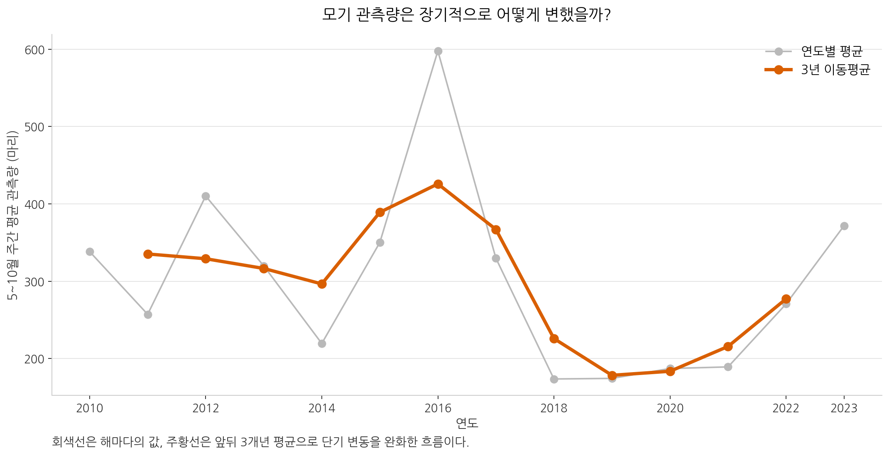
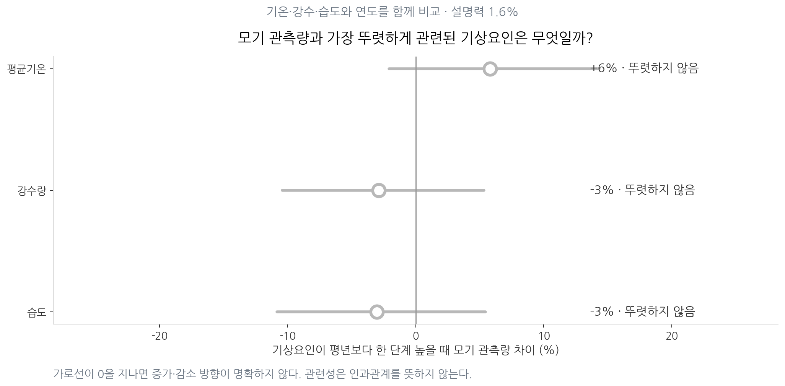

# 서울 빨간집모기 관측량과 기상요인 분석

## 1. 분석 주제

서울의 빨간집모기 관측량이 해마다 어떻게 달라졌는지 확인하고, 같은 기간의 기온 변화 및 강수량·습도와 어떤 관련이 있는지 분석한다.

이 자료는 서울 전체 모기 개체수가 아니라 **유문등에 채집된 빨간집모기 관측량**이다. 따라서 결과도 실제 개체수의 인과관계가 아니라 관측자료에서 확인된 변화와 관련성으로 해석한다.

## 2. 분석 질문

1. 매년 주차별 모기 관측량은 어떤 패턴을 보이는가?
2. 연도별 평균 모기 관측량의 장기 흐름은 어떠한가?
3. 같은 기간의 평균기온은 어떻게 변했는가?
4. 기온·강수량·습도 중 모기 관측량과 뚜렷하게 관련된 요인이 있는가?

## 3. 데이터

| 항목 | 내용 |
|---|---|
| 모기자료 | 서울시 보건환경연구원 유문등 채집자료 |
| 기상자료 | Open-Meteo Historical Weather API의 ERA5 재분석자료 |
| 원자료 기간 | 2008~2023년 4~11월, 전처리 후 478주 |
| 비교분석 기간 | **2010~2023년 5~10월, 360주** |
| 분석대상 | 빨간집모기 관측량, 평균기온, 강수량, 습도 |

모기자료는 주 단위, 기상자료는 일 단위다. 기상자료를 `1~7일=1주`, `8~14일=2주` 방식으로 주 단위 집계한 뒤 같은 연·월·주차끼리 결합했다.

### 3.1 결측치와 이상치 처리

- 빨간집모기 칸이 비어 있으면서 전체 모기 합계가 0인 2건은 빨간집모기도 0임이 확실하므로 0으로 채웠다.
- 2009년 10·11월, 2020~2022년 4월, 2023년 11월처럼 조사하지 않은 달은 0으로 채우지 않았다. 관측하지 않은 것과 0마리는 다르기 때문이다.
- 전체 모기는 30마리 이상인데 빨간집모기만 0인 2건은 기록 오류 가능성이 높아 분석에서 제외했다.
- 최대 1,401마리처럼 큰 값은 오류라는 근거가 없으므로 삭제하지 않았다.

## 4. 분석기간 결정


01번 그림은 원자료 전체를 시간순으로 보여준다. 해마다 모기가 적은 시기와 많은 시기가 반복되지만 봉우리의 높이는 크게 달라진다. 이것이 **계절성**과 연도별 변동이다.


02번 그림을 보면 연도마다 관측한 달이 다르다. 5~10월로 줄여도 2009년 10월이 없기 때문에, 장기 비교는 모든 달이 존재하는 **2010~2023년 5~10월**로 통일했다. 이렇게 해야 조사기간 차이를 모기 증감으로 잘못 해석하지 않는다.

## 5. 시계열 분석

이 프로젝트에서 핵심적으로 사용한 시계열 분석기법은 두 가지다.

1. **시간순 시각화**: 주간 관측량을 시간순으로 그려 반복되는 계절 패턴과 연도별 변동을 확인했다.
2. **연도별 집계와 3년 이동평균**: 같은 기간의 주간 관측량을 연도별 평균으로 묶고, 앞뒤 3개년을 평균내 단기적인 출렁임을 완화했다.

### 5.1 모기 관측량의 장기 흐름



**관찰**

- 회색선은 연도별 5~10월 평균 관측량이며 해마다 변동이 크다.
- 3년 이동평균은 2016년 전후 높아졌다가 2018~2020년에 낮아졌고, 2021년 이후 다시 상승하는 흐름을 보인다.
- 따라서 전체 기간을 단순히 계속 증가 또는 계속 감소했다고 설명하기는 어렵다.

**해석**

모기 관측량은 일정한 직선 방향보다 상승과 하락이 반복되는 형태다. 최근 상승이 장기적인 변화인지 일시적인 반등인지는 이후 연도의 자료가 더 필요하다.

### 5.2 같은 기간의 평균기온 흐름


**관찰**

- 연도별 평균기온도 해마다 오르내린다.
- 3년 이동평균은 2016년 전후 높았고 2019~2021년에 낮아졌다가 최근 다시 높아졌다.
- 모기 관측량과 기온이 일부 비슷하게 움직이는 구간은 있지만 항상 같은 방향은 아니다.

**해석**

평균기온 그래프만으로 기온이 모기 변화의 원인이라고 판단할 수 없다. 그래서 다음 단계에서 강수량과 습도까지 함께 비교한다.

## 6. 기상요인 비교



계절에 따른 당연한 차이를 줄이기 위해 모기 관측량과 각 기상요인을 같은 월·주차의 평균과 비교한 값으로 바꾼 뒤, 기온·강수량·습도를 한꺼번에 비교했다. 연도에 따른 장기 변화도 모델에서 통제했다.

**관찰**

- 평균기온은 평년보다 한 단계 높을 때 모기 관측량이 약 6% 많은 방향이었다.
- 강수량과 습도는 각각 약 3% 적은 방향이었다.
- 그러나 세 요인 모두 불확실성 범위가 0을 지나 증가·감소 방향이 뚜렷하지 않았다.
- 세 기상요인과 연도를 합친 설명력은 약 1.6%였다.

**해석**

이 자료에서는 평균기온·강수량·습도 가운데 모기 관측량을 뚜렷하게 설명하는 단일 요인을 확인하지 못했다. 이는 날씨가 전혀 중요하지 않다는 뜻이 아니라, 방역활동·채집환경·서식지 변화 등 현재 자료에 없는 요인의 영향이 크거나 관계가 더 복잡할 수 있다는 뜻이다.

## 7. 결론

2010~2023년 5~10월의 빨간집모기 관측량은 해마다 큰 차이를 보였다. 3년 이동평균에서는 2016년 전후 증가, 2018~2020년 감소, 최근 재상승이 나타나 한 방향의 단순한 장기추세로 설명하기 어려웠다.

같은 기간의 평균기온도 변했지만 모기 관측량과 항상 같은 방향으로 움직이지 않았다. 기온·강수량·습도를 함께 비교한 결과에서도 뚜렷한 단일 관련요인은 확인되지 않았다. 따라서 모기 관측량 변화는 평균기온 하나만으로 설명하기 어렵다.

## 8. 한계점

- 유문등의 설치 위치·개수·운영방식 변화가 자료에 없다.
- 모기자료는 실제 날짜가 아니라 `7월 3주` 같은 주차 라벨이어서 기상자료와의 결합일이 며칠 어긋날 수 있다.
- 기상자료는 특정 유문등 위치의 실측값이 아니라 서울시청 좌표의 ERA5 재분석자료다.
- 방역활동, 도시개발, 정화조와 하수구 관리 같은 요인은 포함하지 못했다.
- 관련성 분석은 인과관계를 증명하지 않는다.

## 9. AI 사용 로그

### 사용 작업

- 연도별로 형식이 다른 원자료 추출코드 작성
- 결측치·이상치 검사기준 검토
- 주 단위 데이터 결합과 이동평균 코드 작성
- 그래프 구성 및 문장 정리

### 사용 이유

반복적인 데이터 정리 시간을 줄이고 분석방법과 시각화 대안을 비교하기 위해 사용했다.

### 검증 방법

- 원자료의 일부 값을 전처리 결과와 직접 대조했다.
- 전처리 이후 결측치, 음수, 중복 주차가 남아 있는지 코드로 검사했다.
- 모든 스크립트를 처음부터 다시 실행해 같은 표와 그래프가 생성되는지 확인했다.
- 그래프의 축, 분석기간, 한글 표시와 이미지 링크를 확인했다.

## 10. 실행 방법

```bash
pip install -r requirements.txt
python src/step1_preprocess.py
python src/step2_explore.py
python src/step3_trend.py
python src/step4_temperature.py
python src/step6_factors.py
```
