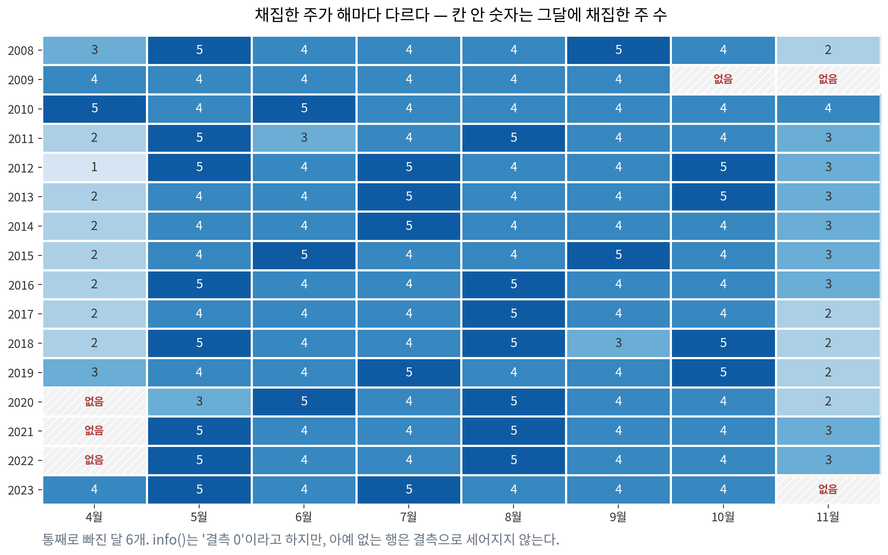
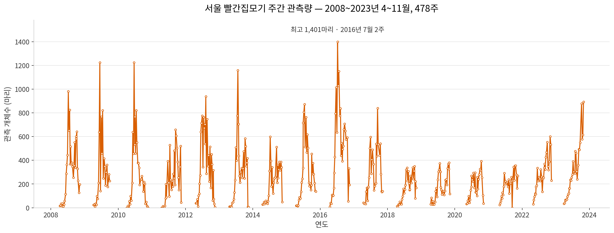
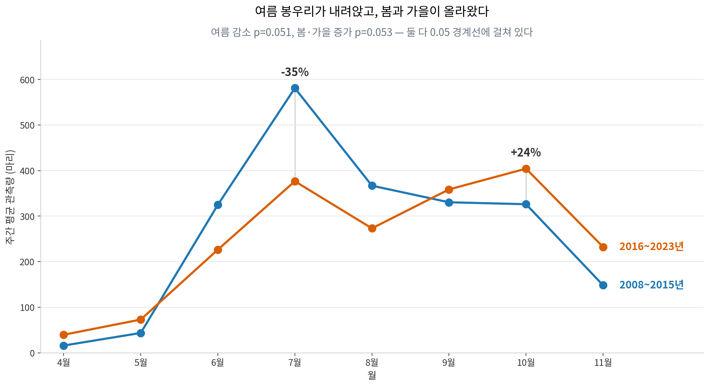
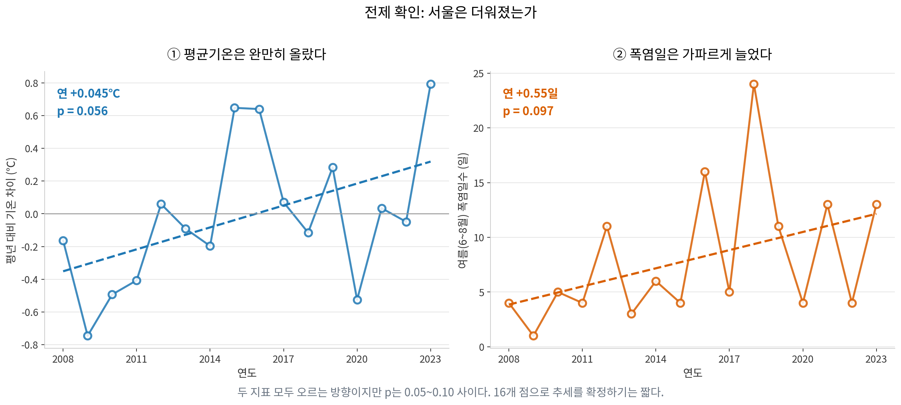
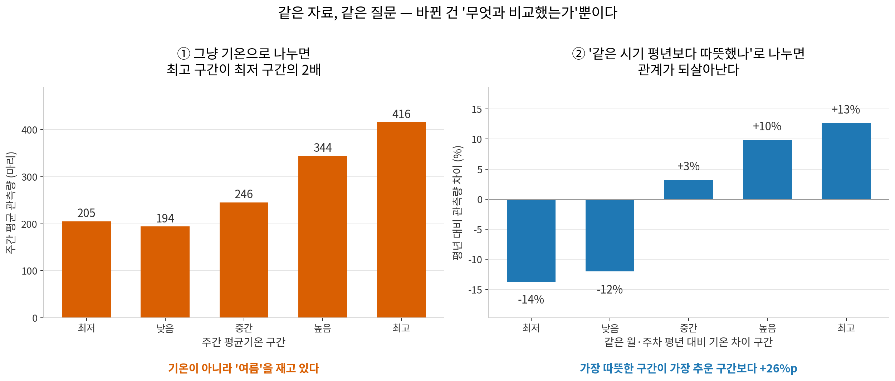
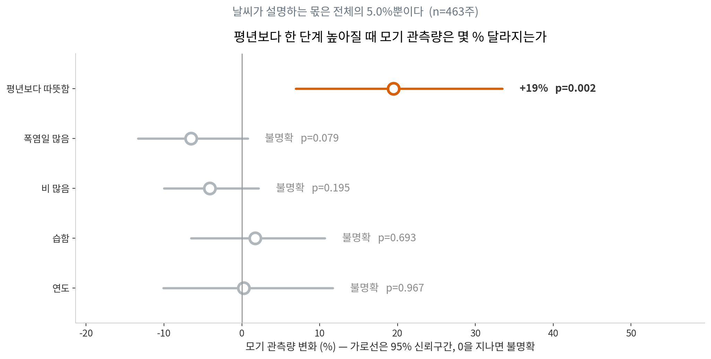
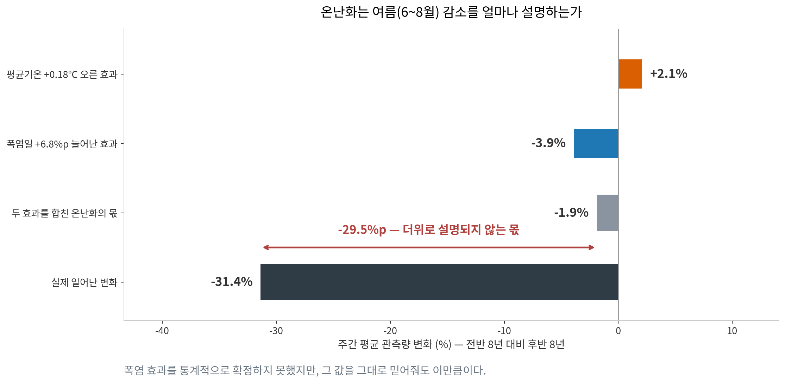

# 요즘 모기가 줄어든 걸까? — 서울 빨간집모기 2008~2023년 트렌드 분석

---

## 1. 분석 주제 및 데이터 선정

### 1.1 왜 이 주제인가

"요즘 모기가 별로 없다"는 말을 자주 듣는다. 그리고 그 이유로 거의 항상 같은 설명이 따라붙는다. **"날이 너무 더워져서 모기가 못 산다."**

말이 되는 것 같지만 확인된 적은 없다. 체감이 뚜렷한 주제는 검증할 것이 있는 주제다. 이 분석은 두 문장이 자료와 맞는지 따진다.

### 1.2 어디서 자료를 구했나

시계열 자료를 구할 곳은 여러 곳이다.

| 출처 | 특징 |
|---|---|
| 공공데이터포털 | 정부 부처·공공기관 자료가 가장 많다. 형식이 제각각이다 |
| Kaggle | 정제된 자료가 많아 시작이 편하다. 한국 자료는 적다 |
| **서울 열린데이터광장** | **서울시 행정 자료. 이번 주제에 딱 맞는 자료가 있다** |

**서울 열린데이터광장**을 골랐다. 서울시 보건환경연구원이 2008년부터 매주 유문등(빛으로 모기를 유인해 잡는 장치)으로 채집한 모기 개체수를 종별로 공개하고 있다. 16년치 주 단위 자료는 흔치 않다.

기상 자료는 Open-Meteo의 ERA5 재분석 자료를 API로 받았다.

### 1.3 자료 요약

| 항목 | 내용 |
|---|---|
| 모기 자료 | 서울시 보건환경연구원 유문등 채집 자료 (서울 열린데이터광장) |
| | `data/raw/mosquito_light_trap_2008_2023.xlsx` — 연도별 시트 16장 |
| 기상 자료 | Open-Meteo Historical Weather API, ERA5 재분석 |
| | `data/raw/seoul_weather_era5_2008_2023.csv` — 5,844일 |
| 기간 | 2008~2023년, 4~11월 (모기 채집이 이루어지는 기간) |
| 분석 대상 종 | 빨간집모기 (*Culex pipiens*) |
| **데이터 포인트** | **478주** (요구 조건인 100개를 크게 넘는다) |

**왜 빨간집모기 한 종인가.** 유문등에 잡힌 전체 모기 153,392마리 중 빨간집모기가 131,763마리로 **85.9%**다. 나머지 종은 주의 55~98%가 0마리라 시계열로 다룰 수 없다.

**왜 주 단위인가.** 선택의 여지가 없다. 모기 원자료 자체가 "7월 3주" 같은 주 단위 라벨로만 기록돼 있어 일 단위로 쪼갤 수 없다. 그래서 기상 자료(일 단위)를 주 단위로 묶어 맞췄다.

---

## 2. 분석 질문

1. **모기는 정말 줄고 있는가?**
2. **온도는 실제로 오르고 있는가?**
3. **기온 말고 모기 개체량에 영향을 주는 것이 또 있는가?**
4. **결국 "너무 더워서 여름에 모기가 줄었다"는 말은 맞는가?**

질문 2가 중요하다. "더워서 줄었다"를 따지려면 **더워졌다는 전제부터 확인**해야 하는데, 이걸 건너뛰고 결론부터 따지는 것이 흔한 실수다.

---

## 3. 데이터 정제 및 시계열 분석

### 3.1 자료 기본 정보

두 자료를 주 단위로 결합한 뒤 `info()`로 확인한 결과다.

```
<class 'pandas.core.frame.DataFrame'>
RangeIndex: 478 entries, 0 to 477
Data columns (total 15 columns):
 #   Column          Non-Null Count  Dtype
---  ------          --------------  -----
 0   year            478 non-null    int64          연도
 1   month           478 non-null    int64          월
 2   week_of_month   478 non-null    int64          그 달의 몇 주차
 3   week_label      478 non-null    object         '7월 3주'
 4   culex           478 non-null    int64          빨간집모기 개체수
 5   total_mosquito  478 non-null    int64          전체 모기 개체수
 6   week_start      478 non-null    datetime64     그 주의 시작일
 7   week_end        478 non-null    datetime64     그 주의 종료일
 8   weather_days    478 non-null    int64          기상 자료가 있는 날 수
 9   avg_temp        478 non-null    float64        주간 평균기온 (℃)
 10  peak_temp       478 non-null    float64        주간 최고기온 (℃)
 11  hot_days        478 non-null    int64          33℃ 이상인 날 수
 12  rain_per_day    478 non-null    float64        하루 평균 강수량 (mm/일)
 13  humidity        478 non-null    float64        주간 평균습도 (%)
 14  hot_day_ratio   478 non-null    float64        폭염일 비율
```

관측량 요약: 평균 275.7마리, 중앙값 225.5마리, 최소 0, 최대 1,401마리.

**주간 결합 방법.** 두 자료를 더하거나 섞은 것이 아니라, 같은 연·월·주차의 값을 한 행에 나란히 놓았다. 주차는 `(일-1)//7+1` 규칙으로 나눴다(1~7일=1주, 8~14일=2주, …).

**강수량은 '주간 합계'가 아니라 '하루 평균'이다.** 5주차는 29~31일이라 2~3일밖에 없다(478주 중 41주). 합계를 쓰면 이 41개 주만 강수량이 체계적으로 작게 나와 없는 패턴이 생긴다.

### 3.2 결측치 — "결측 0"이 함정이다

`info()`는 결측이 0이라고 말한다. **그런데 그건 표에 적힌 값 중에 빈 칸이 없다는 뜻일 뿐이다.** 채집을 아예 안 한 주는 행 자체가 없으므로 결측으로 세어지지 않는다. 따로 세어봐야 보인다.



| 연도 | 관측 범위 | 빠진 달 |
|---|---|---|
| 2008, 2010~2019 | 4~11월 | 없음 |
| 2009 | 4~9월 | **10, 11월** |
| 2020~2022 | 5~11월 | **4월** |
| 2023 | 4~10월 | **11월** |

통째로 빠진 달이 **6개**다. 월별 주 수도 1~5주로 들쭉날쭉하다.

이걸 무시하고 연도별 평균을 비교하면 **자료가 없어서 생긴 차이를 모기 수 변화로 잘못 읽는다.** 2009년은 모기가 적은 10·11월이 빠졌으니 그해 평균이 저절로 높아진다. 처리 방법은 3.4절에서 다룬다.

**빈 칸 결측 2건.** 2010년 4월 1주와 4월 5주는 종별 칸이 모두 비어 있고 `계`만 0으로 적혀 있다. 전체 합이 0이면 그 안의 어떤 종도 0이다. 추측이 아니라 산술적으로 확실하므로 이 경우에만 0으로 채웠다. 이 규칙으로 채워지지 않는 결측이 있으면 코드가 멈추게 해뒀다.

### 3.3 이상치 — 같은 0이라도 성격이 다르다

0마리인 주가 8개 있었다. **옆 칸(전체 모기 수)을 보면 성격이 갈린다.**

| 주차 | 빨간집모기 | 전체 모기 | 판정 | 처리 |
|---|---:|---:|---|---|
| 2010 4월 1주·5주, 11월 4주 | 0 | 0 | 진짜 0 (초봄·늦가을) | 유지 |
| 2011 4월 3주·4주 | 0 | 1 | 진짜 0에 가까움 | 유지 |
| 2021 9월 3주 | 0 | 2 | 채집이 거의 안 된 주 | 유지 |
| 2008 6월 1주 | 0 | 47 | 의심 | **제외** |
| **2009 9월 3주** | **0** | **418** | **기록 오류** | **제외** |

**2009년 9월 3주가 결정적이다.** 9월 성수기에 다른 종은 418마리가 잡혔는데, 전체의 86%를 차지하는 종만 정확히 0. 물리적으로 어렵다.

**처리 기준: 전체 모기가 30마리 이상 잡혔는데 빨간집모기가 0인 주는 기록 오류로 보고 분석에서 제외한다.** 임의의 값을 채워 넣지는 않았다. 모르는 것은 모르는 채로 둔다. 480주 → **478주**.

**큰 값은 지우지 않았다.** 최대 1,401마리(2016년 7월 2주) 등 유난히 큰 주가 있지만 입력 오류라는 근거가 없다. 대신 두 가지로 영향을 줄였다.
- 상관은 값의 크기 대신 순위를 쓰는 스피어만 방식 사용
- 회귀는 종속변수에 로그를 씌워 큰 값의 영향을 압축

### 3.4 원자료 자체의 결함 — 연도 간 값 복사 의심

서로 다른 연도의 같은 주차 값이 정확히 일치하는지 전수 검사했다(120개 연도쌍).

| 주차 | 2009 | 2010 |
|---|---:|---:|
| 5월 3주 | 98 | 98 |
| 6월 1주 | 210 | 210 |
| 6월 2주 | **638** | **638** |
| 7월 1주 | **768** | **768** |
| 7월 2주 | 459 | 459 |
| 7월 3주 | **822** | **822** |

**2009·2010은 공통 22주 중 6주가 값까지 같다. 나머지 119개 연도쌍은 최대 1주만 일치한다.** 638·768·822 같은 세 자리 수가 우연히 겹칠 확률은 사실상 0이다. 원자료를 옮겨 적는 과정의 복사 오류로 보인다.

**자동으로 고치지 않았다.** 어느 쪽이 맞는지 알 수 없기 때문이다. 지우면 그것대로 자료를 만드는 셈이 된다. 대신 검사 결과를 `data/processed/duplicate_year_scan.csv`로 남기고 한계점에 명시했다.

### 3.5 적용한 시계열 분석 기법

| 기법 | 무엇을 하나 | 왜 필요했나 |
|---|---|---|
| **계절 보정 (평년 대비 지수)** | 각 주를 그 월·주차 평년값으로 나눈다 | 계절성이 장기 변화를 덮고, 연도별 관측 기간이 다르다 |
| **구간별 통계** | 기온을 5등분해 평균 비교 | 기온과 모기의 관계를 눈으로 확인 |
| **다중 회귀 (로그-표준화)** | 여러 요인을 동시에 놓고 세기 비교 | 요인끼리 얽혀 있어 하나씩 보면 남의 효과를 가져간다 |

**계절 보정이 이 분석의 중심이다.** 코드는 한 줄이다.

```python
d["index"] = d.culex / d.groupby(["month", "week_of_month"]).culex.transform("mean")
```

7월 3주에 800마리, 7월 3주 평년이 534마리 → **1.50배**. 이러면 4월이든 7월이든 모두 평년=1.0 기준이 되어 관측 기간이 달라도 공정하게 비교할 수 있다.

단, 평년값을 만들 근거가 부족한 주차(해당 월·주차가 5개 연도 미만)는 제외했다. 표본 2개로 만든 평균을 기준선이라고 부를 수는 없다. **478주 → 463주.**

**회귀에는 두 가지 장치를 썼다.**
- **종속변수에 로그** → 계수를 "몇 % 변하는가"로 읽을 수 있다
- **독립변수를 표준화** → 단위가 다른 요인(℃, %, mm)을 같은 잣대로 비교할 수 있다

또 이웃한 주는 서로 닮아 있어(이번 주 많으면 다음 주도 많음) 일반적인 p-value는 실제보다 작게 나온다. 이를 감안한 **HAC 표준오차**를 회귀에 사용했다. 다만 연도 단위(16개 점) 추세 검정에는 HAC를 쓰지 않았다. 표본이 너무 작아 오히려 p를 과소평가하기 때문이다.

---

## 4. 분석 결과 및 시각화

### 4.1 일단 그려본다



**관찰**
- 478주가 0마리에서 1,401마리까지 오르내린다.
- 해마다 같은 모양의 봉우리가 반복되고, 봉우리 높이는 들쭉날쭉하다.
- 정작 "16년 동안 늘었나 줄었나"는 이 그림으로 알 수 없다.

**해석(가설)** 계절에 따른 오르내림이 너무 커서 장기 변화를 덮고 있다. 계절을 걷어내야 한다.

### 4.2 질문 1 — 모기는 정말 줄었는가



**관찰**

| 월 | 2008~2015 | 2016~2023 | 변화 |
|---|---:|---:|---:|
| 4월 | 15.9 | 39.5 | **+149.3%** |
| 5월 | 43.5 | 72.9 | +67.6% |
| 6월 | 324.8 | 226.4 | −30.3% |
| 7월 | 581.1 | 376.6 | **−35.2%** |
| 8월 | 366.9 | 273.2 | −25.5% |
| 9월 | 330.4 | 358.6 | +8.5% |
| 10월 | 326.2 | 404.3 | +23.9% |
| 11월 | 148.2 | 232.4 | +56.8% |

평년 대비 지수로 계절을 나눠 보면:

| 구간 | 전반 8년 | 후반 8년 | 연 추세 | p |
|---|---:|---:|---:|---:|
| 여름 (6~8월) | 1.17배 | **0.84배** | −0.050 | 0.051 |
| 봄·가을 (4·5·9~11월) | 0.84배 | **1.16배** | +0.036 | 0.053 |
| **전체** | — | — | −0.003 | **0.881** |

**해석(가설)** **총량은 줄지 않았다.** 전체 추세가 평평했던 이유는 변화가 없어서가 아니라, **여름의 감소와 봄·가을의 증가가 서로 상쇄됐기 때문**이다. 사람들이 "모기가 줄었다"고 느끼는 이유는 모기를 의식하는 시기가 한여름이기 때문일 가능성이 높다. 실제로 7월은 35% 줄었다.

계절별 p값은 둘 다 0.05 경계선(0.051, 0.053)에 걸쳐 있다. **16개 점으로 추세를 확정하기에는 짧다.** 패턴의 방향은 일관되지만, "확실하다"고 말하지는 않는다.

만약 분석 범위를 6~10월로 잡았다면 봄·가을 증가가 대부분 잘려나가 **"줄었다"는 정반대 결론**이 나왔을 것이다. 분석 범위를 어디로 정하느냐가 결론을 바꾼다.

### 4.3 질문 2 — 온도는 실제로 올랐는가



**관찰**

| 지표 | 연 추세 | p | 전반 8년 → 후반 8년 |
|---|---:|---:|---|
| 평년 대비 기온 | +0.045℃ | 0.056 | −0.30℃ → +0.30℃ |
| **여름 폭염일수** | **+0.55일** | 0.097 | **4.75일 → 11.25일** |

**해석(가설)** 더워진 것은 맞다. 그런데 **평균기온은 완만하게 오른 반면 폭염일수는 2.4배로 늘었다.** '따뜻해진 것'과 '폭염이 늘어난 것'은 다른 이야기이고, 모기에게 미치는 영향도 다를 수 있다. 4.5절에서 나눠서 따진다.

두 지표 모두 p가 0.05~0.10 사이다. 방향은 뚜렷하지만 16개 점으로는 확정하기 어렵다.

### 4.4 질문 3 — 무엇이 영향을 주는가 (1) 비교 대상 정하기



**관찰**
- 기온을 5등분해 원 관측량을 비교하면 최고 구간(27.1℃)이 최저 구간(11.2℃)의 **2.0배**다.
- 그런데 '같은 시기 평년보다 따뜻한가'로 다시 나누면 **−13.7%에서 +12.6%까지, 26%p 차이**로 관계가 나타난다.

**해석(가설)** 왼쪽의 2배 차이는 "더워서"가 아니라 **"여름이라서"** 생긴 것이다. 여름이 덥고 여름에 모기가 많으니 당연히 그렇게 보인다. 같은 시기끼리 견줘야 날씨만의 효과가 남는다. **무엇과 비교하느냐가 답을 바꾼다.**

### 4.5 질문 3 — 무엇이 영향을 주는가 (2) 요인별 세기



**관찰** (평년보다 1표준편차 높아질 때 모기 관측량 변화, n=463주)

| 요인 | 효과 | 95% 신뢰구간 | p | 판정 |
|---|---:|---:|---:|---|
| **평년보다 따뜻함** | **+19.5%** | +6.9% ~ +33.5% | 0.002 | **유의** |
| 폭염일 많음 | −6.5% | −13.3% ~ +0.8% | 0.079 | 불명확 |
| 비 많음 | −4.1% | −10.0% ~ +2.2% | 0.195 | 불명확 |
| 습함 | +1.7% | −6.5% ~ +10.7% | 0.693 | 불명확 |
| 연도 | +0.2% | −10.1% ~ +11.7% | 0.967 | 불명확 |

**설명력 R² = 0.050.**

**해석(가설)** 기온이 가장 강한 요인이고, 나머지는 이 자료로 방향을 확정할 수 없다. 주목할 점은 기온이 **두 개의 반대 방향 효과**로 갈린다는 것이다. 평년보다 따뜻하면 늘고(+19.5%), 폭염일이 많으면 준다(−6.5%). '기온' 하나로 뭉뚱그리면 두 힘이 상쇄돼 아무 관계도 없어 보인다.

다만 폭염 효과는 p=0.079로 확정하지 못했다. 방향만 참고한다.

### 4.6 질문 4 — "더워서 여름에 줄었다"가 맞는가

앞의 회귀는 **주 단위 날씨 변동**의 효과를 잰다. 그것만으로는 "16년 동안 더워져서 줄었다"에 답할 수 없다. 둘은 다른 질문이다. 답하려면 한 단계가 더 필요하다.

> 실제로 오른 기온 × 회귀에서 얻은 한 단계당 효과 = **온난화의 몫**



**관찰** (여름 6~8월, 전반 8년 대비 후반 8년)

| 항목 | 값 |
|---|---:|
| 평균기온 +0.18℃ 오른 효과 | +2.1% |
| 폭염일 +6.8%p 늘어난 효과 | −3.9% |
| **두 효과를 합친 온난화의 몫** | **−1.9%** |
| **실제 일어난 변화** | **−31.4%** |
| **더위로 설명되지 않는 몫** | **−29.5%p** |

폭염 효과가 통계적으로 확정되지 않았음에도 그 값을 **그대로 믿어주고** 계산한 결과다. 관대하게 잡아도 이만큼이다.

**해석(가설)** **속설은 방향이 맞고 크기가 안 맞는다.** 폭염이 늘어 모기가 줄어든 것은 방향상 사실이지만, 그것으로 설명되는 여름 감소는 −4% 남짓이고 실제 감소는 −31%다. 게다가 평균기온 상승은 반대로 모기를 늘리는 방향이라 그 −4%를 다시 갉아먹는다. **31% 중 2%를 설명한다.**

나머지 29%p는 이 자료 밖에 있다.

---

## 5. 인사이트

### 인사이트 1. 모기는 줄지 않았다. 시기가 옮겨갔다.

- **관찰(Fact)** — 4~11월 전체의 장기 추세는 연 −0.003배, p=0.881로 사실상 0이다. 그런데 여름(6~8월)은 1.17배 → 0.84배로 줄고, 봄·가을은 0.84배 → 1.16배로 늘었다. 7월 −35.2%, 4월 +149.3%.
- **원인(Why)** — 여름의 감소와 봄·가을의 증가가 거의 정확히 상쇄됐다. 사람들이 "모기가 줄었다"고 느끼는 이유는 모기를 의식하는 시기가 한여름이기 때문으로 보인다.
- **행동(Action)** — 방역 일정을 여름에 몰아두는 관행을 재검토할 근거가 된다. 10~11월 방역과 시민 안내를 강화하고, 4~5월 조기 개시도 검토할 만하다. 다음 분석으로는 시즌 시작일과 종료일을 정의해 며칠씩 이동했는지 직접 재는 것이 좋겠다.

### 인사이트 2. "너무 더워서 없다"는 말은 크기가 맞지 않는다.

- **관찰(Fact)** — 여름 폭염일수는 4.75일 → 11.25일로 2.4배 늘었다. 폭염일이 1표준편차 많은 주에 모기는 −6.5% 준다(p=0.079). 그런데 이 둘을 곱해 나온 온난화의 몫은 **−1.9%**이고, 실제 여름 감소는 **−31.4%**다.
- **원인(Why)** — '따뜻함'과 '폭염'은 다른 것이다. 적당히 따뜻하면 모기가 늘고(+19.5%, p=0.002), 극단적인 더위는 줄인다. 두 힘이 서로를 상쇄한다. 속설은 두 번째 효과만 보고 첫 번째를 놓쳤고, 그나마도 크기를 재지 않았다.
- **행동(Action)** — "더워서 줄었다"는 단일 원인 설명을 채택하기 전에 방역 예산·살충제 사용량·유문등 운영 이력 같은 자료를 확보해 함께 넣어야 한다. 그리고 방향이 맞는 것과 크기가 맞는 것은 다르다는 점을 어떤 인과 주장에도 적용해야 한다.

### 인사이트 3. 비교 대상을 맞추지 않으면 답이 뒤집힌다.

- **관찰(Fact)** — 같은 자료로 기온과 모기의 관계를 두 방식으로 봤더니 답이 달랐다. 절대 기온 5구간별 원 관측량은 2.0배 차이가 났지만, 같은 시기 평년 대비 기온 차이로 나누자 26%p 차이로 바뀌었다. 분석 범위도 마찬가지다. 6~10월만 봤다면 "줄었다", 4~11월을 보니 "옮겨갔다"였다.
- **원인(Why)** — 첫 번째는 기온이 아니라 계절을 재고 있었다. 여름이 덥고 여름에 모기가 많으니 당연히 그렇게 보인다. 기준선을 무엇으로 두느냐가 패턴을 만들기도 지우기도 한다.
- **행동(Action)** — 어떤 시계열이든 '무엇과 비교하는가'를 먼저 정하고 분석을 시작해야 한다. 이 프로젝트에서는 '같은 월·주차의 평년값'을 기준으로 삼았고, 그 결정 하나가 4.2·4.4·4.5·4.6절의 결론을 모두 바꿨다.

### 인사이트 4. 날씨는 이 이야기의 일부일 뿐이다.

- **관찰(Fact)** — 기후요인 네 개와 연도를 모두 넣은 회귀의 설명력은 **R² = 0.050**이다. 주 단위 오르내림의 5.0%만 설명된다. 날씨를 보정한 뒤 남는 연도 효과도 +0.2%(p=0.967)로 방향이 불분명하다.
- **원인(Why)** — 나머지 95%는 이 자료에 들어 있지 않은 것들이다. 방역 활동의 강도와 시점, 유문등의 설치 위치·개수·장비 변경, 도시 개발에 따른 서식지 변화, 정화조·하수구 관리 상태 등이 후보다.
- **행동(Action)** — 4.6절의 설명되지 않는 29.5%p가 다음 분석의 주소다. 데이터가 "여기서부터는 내 소관이 아니다"라고 말하는 지점이므로, 바깥 자료를 붙이지 않으면 더 나아갈 수 없다.

---

## 6. 결론 및 한계점

### 결론

2008~2023년 서울의 유문등 자료에서 **빨간집모기 총량은 줄지 않았다.** 4~11월 전체의 장기 추세는 통계적으로 0과 구별되지 않는다(p=0.881). 대신 **발생 시기가 뒤로 밀렸다.** 여름은 25~35% 줄었고 봄과 가을은 8~149% 늘었다.

기온은 올랐다. 특히 여름 폭염일수가 4.75일에서 11.25일로 **2.4배** 늘었다.

그런데 **"날이 너무 더워져서 모기가 못 산다"는 설명은 크기가 맞지 않는다.** 폭염이 모기를 줄이는 방향인 것은 맞지만(−6.5%, 다만 p=0.079로 미확정), 실제로 늘어난 폭염으로 설명되는 여름 감소는 −1.9%에 그친다. 실제 감소는 −31.4%다. **31% 중 2%를 설명한다.**

날씨로 설명되는 몫은 주 단위 변동의 5.0%뿐이다. 나머지는 이 자료 밖에 있으며, 단일 원인으로 결론을 내리기에는 부족하다.

### 한계점

- **원자료에 복사 오류로 보이는 부분이 있다.** 2009·2010년 사이 6개 주차의 값이 정확히 일치한다. 어느 쪽이 맞는지 알 수 없어 그대로 두었다. 두 해 모두 전반기에 속하므로 전반기 평균이 왜곡됐을 가능성이 있다.
- **채집 노력이 자료에 없다.** 유문등의 개수·위치·장비가 16년 동안 바뀌었을 수 있지만 원자료에 기록이 없다. 관측량 변화의 일부가 여기서 왔을 가능성을 배제할 수 없다. **이 분석에서 가장 큰 한계다.**
- **16년은 추세를 확정하기에 짧다.** 계절별 모기 추세(p=0.051, 0.053)와 기온 추세(p=0.056, 0.097)가 모두 0.05 경계선에 걸쳐 있다.
- **주차 정렬이 근사값이다.** 모기 원자료의 채집일은 실제 날짜가 아니라 "7월 3주" 같은 라벨이다. 서울시가 이 라벨을 어떤 규칙으로 붙였는지 확인할 수 없어 기상 자료를 `(일-1)//7+1` 규칙으로 나눠 맞췄다.
- **5주차는 2~3일뿐이다.** 478주 중 41주가 해당한다. 모든 기상 변수를 하루 평균으로 통일해 완화했지만, 표본이 적어 값이 불안정하다.
- **기상 자료는 실측이 아니다.** ERA5는 격자 재분석 자료라 서울 안 특정 관측소의 실측값과 차이가 있다. 유문등이 놓인 자리의 미기후와는 더 다르다.
- **4.6절 계산에는 가정이 하나 들어 있다.** "주 단위 날씨 반응이 10년 단위에도 같은 크기로 적용된다"는 가정이다. 실제로는 장기적으로 서식지가 바뀌거나 모기가 적응하면 달라질 수 있다.
- **사람을 무는 모기는 거의 안 잡혔다.** 낮에 사람을 무는 흰줄숲모기는 16년 통틀어 477마리뿐이다. 유문등이 집모기류 위주로 잡는 장비이기 때문이다. 이 분석은 "물리는 횟수가 줄었나"에는 답하지 못한다.
- **상관은 인과가 아니다.** 회귀계수는 관련성의 크기일 뿐 원인을 증명하지 않는다. 4장의 '해석'은 모두 검증이 필요한 가설이다.

---

## 7. AI 사용 로그

### 1. 사용 작업

- 원자료 엑셀 16개 시트의 구조 차이(머리글 위치, 종명 표기 변경) 파악과 추출 코드 작성
- 주 단위 결합, 평년 대비 지수, 구간별 통계, 회귀 코드 작성
- 그래프 구성과 배치, 리포트 문장 다듬기

### 2. 사용 이유

- 16개 시트의 서식이 제각각이라 수작업 확인에 시간이 오래 걸렸다. 반복 확인을 줄이기 위해 사용했다.
- 분석 방법의 대안을 비교하기 위해 사용했다. '주간 합계 강수량'과 '하루 평균 강수량', '기온 제곱항'과 '폭염일 비율' 중 무엇이 맞는지를 각각 돌려보고 골랐다.

### 3. 검증 방법과 **실제로 걸러낸 것들**

AI가 준 결과를 그대로 쓰지 않았다. 검증 과정에서 실제로 다음을 잡아냈다.

| 검증 | 잡아낸 것 |
|---|---|
| **원자료 직접 대조** | AI는 못 찾았다. 사람이 값을 눈으로 훑다가 **2009·2010년 6개 주차가 동일**한 것을 발견했다 |
| **0의 성격 확인** | 전체 모기 칸과 대조해 **2009년 9월 3주(0/418)가 기록 오류**임을 확인. AI의 첫 코드는 이를 실제 0으로 처리하고 있었다 |
| **결과와 질문의 대응 점검** | AI가 만든 회귀 차트가 "기온이 오르면 +21%"라고 말했는데, 우리 질문은 "16년 온난화가 감소를 설명하나"였다. **다른 질문에 답하고 있었다.** 그래서 4.6절을 새로 만들었다 |
| **가정 점검** | 16개 점짜리 연도 시계열에 HAC 표준오차를 적용하면 p가 0.056에서 0.008로 떨어졌다. **소표본에서 신뢰할 수 없는 값**이라 제거했다 |
| **대안 비교** | 기온 제곱항(p=0.159)과 폭염일 비율(p=0.079)을 각각 넣어 비교하고 후자를 채택했다 |
| **그래프 육안 점검** | 축 범위, 결측 구간이 선으로 이어지지 않는지, 한글이 깨지지 않는지, 라벨이 겹치지 않는지 모든 그림을 열어 확인했다 |

### 4. 최종 판단

AI가 제안한 방법을 그대로 결론으로 쓰지 않았다. 특히 "6~10월만 분석"과 "4~11월 전체 분석"의 결과가 정반대로 나오는 것을 확인한 뒤, **원자료에 있는 기간을 버리지 않는다**는 기준으로 4~11월을 선택했고 그 판단 근거를 4.2절에 남겼다. 각 절의 '관찰'과 '해석'은 의도적으로 분리했으며, 해석은 모두 가설로 표기했다.

---

## 8. 실행 방법

Python 3.10 이상이 필요하다. 저장소 최상위 폴더에서 실행한다.

```bash
pip install -r requirements.txt

python src/step1_preprocess.py     # 원자료 → 주 단위 분석표 (478주)
python src/step2_explore.py        # 기본 정보 확인, 관측 현황
python src/step3_seasonality.py    # 계절 보정, 계절 이동
python src/step4_temperature.py    # 기온·폭염일 추세
python src/step5_binned_stats.py   # 기온 구간별 통계
python src/step6_regression.py     # 회귀, 온난화의 몫
```

`step1`을 먼저 실행해야 나머지가 동작한다. `step2`~`step6`은 순서를 바꿔도 된다.

기상 자료는 저장소에 포함돼 있으므로 다시 받을 필요가 없다. 기간을 바꾸거나 자료를 갱신하려면 `python src/step0_collect_weather.py`를 실행한다.

### 폴더 구조

```
cody3-1/
├── README.md
├── REPORT.md                  ← 이 문서
├── requirements.txt
├── data/
│   ├── raw/                   ← 원자료 (수정하지 않음)
│   └── processed/             ← step1이 만드는 분석표와 점검 결과
├── src/
│   ├── config.py              ← 경로·폰트·색상 공통 설정
│   ├── analysis.py            ← 평년 대비 계산 등 공통 함수
│   └── step0~6_*.py           ← 단계별 실행 스크립트
├── images/                    ← 그래프 7장 (스크립트가 생성)
├── slides/                    ← 강연 슬라이드
└── docs/                      ← 과제 지침서
```

### 자료 이용 조건

- 모기 자료: 서울 열린데이터광장 공개 자료. 출처 표시 조건으로 이용 가능.
- 기상 자료: Open-Meteo (ERA5). 비상업적 이용 무료, 출처 표시 필요. https://open-meteo.com/
